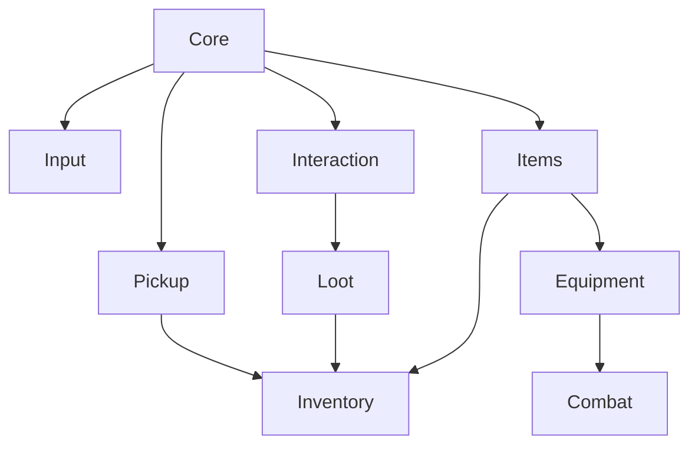

# System Architecture

## Core Principles

### SOLID Principles

**Single Responsibility**
- Each class has one reason to change
- PickupDetector only detects, PickupHandler only handles logic

**Open/Closed**
- Base classes (InteractableBase, ItemDataBase) open for extension
- Closed for modification via inheritance

**Liskov Substitution**
- All ItemDataBase derivatives can be used interchangeably
- All IInteractable implementations work with InteractionDetector

**Interface Segregation**
- IPickupable separate from IInteractable
- ILootContainer specific to containers

**Dependency Inversion**
- Systems depend on abstractions (interfaces)
- Not concrete implementations

### Network Architecture

**Server Authority**
```
Client Input → ServerRpc → Server Validation → Server Logic → ObserversRpc → Client Update
```

**Example: Pickup Flow**
```
1. Client: PickupDetector.Update() - Raycast detection
2. Client: Input detected
3. Client→Server: PickupHandler.ServerPickup[ServerRpc]
4. Server: Validate distance, line of sight, inventory space
5. Server: Add item to inventory
6. Server→Clients: Sync inventory state
7. Server→All: PlayPickupAnimation[ObserversRpc]
```

### Data Flow

**Item Creation**
```
ItemDatabaseManager → ItemDataBase (ScriptableObject) → ItemInstanceFactory → ItemInstance (runtime)
```

**Equipment with Attachments**
```
EquipmentManager.Equip() → AttachmentManager.Initialize() → AttachmentSlot[] created → Stats calculated
```

## Module Dependencies


## Extension Points

### Custom Items
Extend `ItemDataBase` or specific types:
- `WeaponData`
- `ArmorData`
- `ConsumableData`

### Custom Interactables
Extend `InteractableBase`:
```csharp
public class TeleporterInteractable : InteractableBase
{
    public override void OnInteract(NetworkConnection player)
    {
        // Teleport logic
    }
}
```

### Custom Attachments
Create `AttachmentData` ScriptableObjects with modifiers.

### Custom Inventory
Extend `InventoryComponentBase`:
```csharp
public class WeightBasedInventory : InventoryComponentBase
{
    public float maxWeight = 50f;
    // Custom logic
}
```

## Performance Optimization

### Object Pooling
- NetworkLootItem pooling recommended for high item counts
- Particle effects pooling

### Network Optimization
- SyncVar only for critical data
- Batch RPCs when possible
- Use TargetRpc for player-specific updates

### Memory Management
- AttachmentManager cleanup in OnDestroy
- Dictionary clearing
- Event unsubscription

## Testing Strategy

### Unit Tests
- ItemInstanceFactory
- StatCalculator
- ItemStackingService

### Integration Tests
- Pickup flow end-to-end
- Equipment + Attachment flow
- Combat damage flow

### Network Tests
- Multi-client synchronization
- Late-join synchronization
- Reconnection handling
```

**Tasks:**
- [ ] Write README
- [ ] Write ARCHITECTURE
- [ ] API documentation
- [ ] Tutorial guides

**Estimated Time:** 4 giờ

---

### **TODO 10.4: Create Example Scenes** ⬜
**Objective:** Demo scenes cho testing

**Tasks:**

#### **Scene 1: Pickup Test Scene**
```
Assets/NightHunt/Examples/Scenes/PickupTest.unity

Contents:
- Player spawn point
- 10-15 scattered loot items
- Auto pickup trigger visualization
- UI with pickup settings toggle
```

#### **Scene 2: Interaction Test Scene**
```
Assets/NightHunt/Examples/Scenes/InteractionTest.unity

Contents:
- Various door types (immediate, hold, auto)
- Chests with random loot
- NPCs
- UI with interaction prompts
```

#### **Scene 3: Attachment Test Scene**
```
Assets/NightHunt/Examples/Scenes/AttachmentTest.unity

Contents:
- Weapon workbench
- Various attachments on ground
- UI showing stat changes
- Visual attachment points
```

#### **Scene 4: Combat Test Scene**
```
Assets/NightHunt/Examples/Scenes/CombatTest.unity

Contents:
- Target dummies
- Weapon spawners
- Damage number display
- Health UI
```

#### **Scene 5: Full Integration Scene**
```
Assets/NightHunt/Examples/Scenes/FullDemo.unity

Contents:
- Complete gameplay loop
- Multiple players support
- All systems integrated