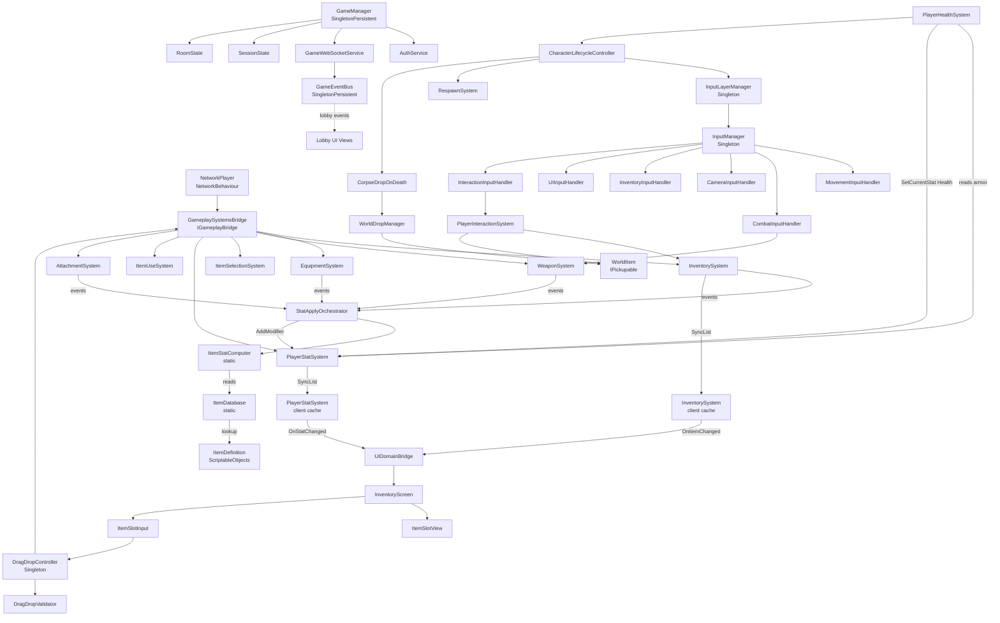
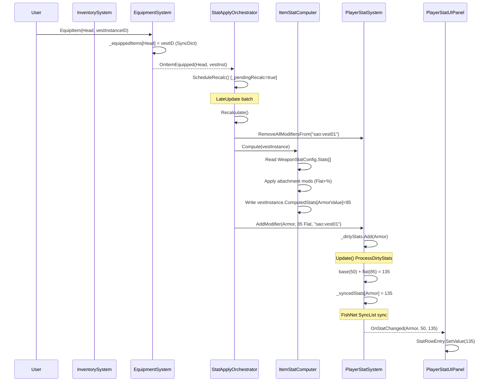
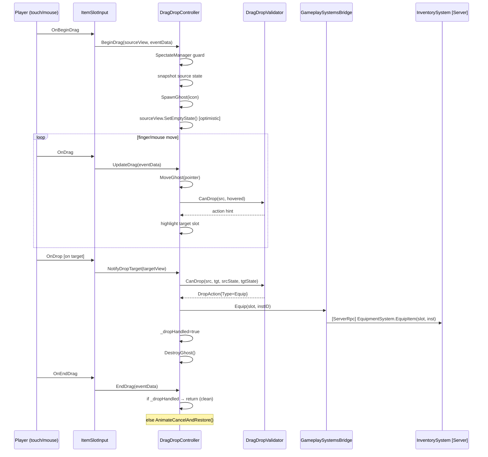
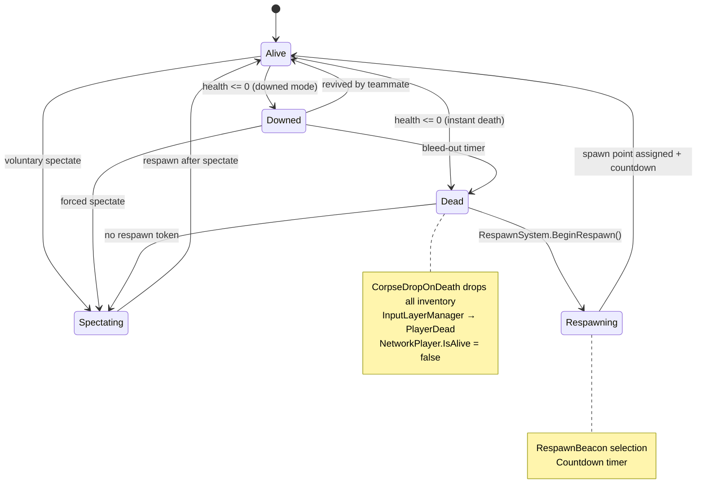

# NightHunt Client — Full Architecture Analysis
> Generated: April 2026 | **Last Refactor: April 1, 2026** | Scan: 250+ scripts | Network: FishNet | Unity version: URP

---

## 📁 1. Project Structure — Script Map

```
Assets/_Night_Hunt/Scripts/
├── Common/           ApiResult, Constants
├── Config/           BackendConfig, GameModeConfig, GameSettings, InstanceConfig, MapConfig, SceneConfig
├── Core/
│   ├── Base/         Singleton, SingletonPersistent, SingletonBase, ScriptableObjectSingleton,
│   │                 **BaseNetworkGameplaySystem** ← NEW (abstract NetworkBehaviour base)
│   ├── Events/       GameEventBus (lobby/service events)
│   └── GameManager, LoadingManager, PersistentObject, SceneLoader
├── Data/
│   ├── DTOs/         AuthDTOs, MatchmakingDTOs, RoomDTOs, SocialDTOs
│   ├── ErrorCodes, GameConfigData
├── Gameplay/
│   ├── AntiCamping/  AntiCampingSystem, CampingDetector, CampingPenalty
│   ├── Beacon/       BeaconDefinition, BeaconManager, BeaconPlaceable
│   ├── Boss/         BossController, BossSpawnManager, TurretGun
│   ├── Camera/       CameraStateManager, CameraUtils, CameraZoomInput, GameCameraController
│   ├── Character/
│   │   ├── Combat/   PlayerHealthSystem, DamageCalculator, DamageInfo, IHittable,
│   │   │             PlayerHitboxMarker, WeaponBase, ProjectileBase/Component/Pool
│   │   ├── Data/     CharacterDatabase, CharacterDefinition
│   │   ├── Movement/ RigidbodyPredictedMovement, BaseCharacterPredictedMovement,
│   │   │             MovementDataSerializers, MovementReconcileData, MovementReplicateData,
│   │   │             MovementSettings, MovementState, MovementUtils
│   │   └── CharacterAnimationController, CharacterVisualController, IMovementController,
│   │       PlayerModelLoader, PlayerVisionSystem
│   ├── ClientEffects/ ClientEffectManager, DamageEffectEvent, ProjectileSpawnEvent
│   ├── Core/
│   │   ├── Config/   ConfigValidator, IConfigurable, RuntimeConfig
│   │   ├── Events/   ClientEffectEvent, EventDispatcher, GameplayEventBus, GameplayEvents,
│   │   │             IGameplayEvent
│   │   ├── State/    CharacterInputLifecycle, CharacterLifecycleController,
│   │   │             CharacterStateMachine, IStateMachine, StateMachine, StateMachineComponent
│   │   ├── Utils/    MathUtils, NetworkUtils, SpawnUtils, TimeUtils, ValidationUtils
│   │   └── GameBootstrap
│   ├── Deployables/  BaseDeployable, VisionWard
│   ├── Feedback/     DamageFeedbackSystem, DamageNumber, HitIndicator
│   ├── FogOfWar/     FogTeamDebugController, FogTeamVisibilityBinder, FogVisionBinder
│   ├── GameplaySystems/
│   │   ├── Core/
│   │   │   ├── Bridge/     GameplaySystemsBridge, IGameplayBridge
│   │   │   ├── Configs/    GameplayConfig, InteractableConfig, InteractionMode,
│   │   │   │               InventoryConfig, LootableConfig, NightHuntDebugConfig, SpawnTable
│   │   │   ├── Data/       AttachmentSlotDefinition, ConsumableDefinition, EquipmentDefinition,
│   │   │   │               ItemDefinition, ItemInstance, ItemInstanceData, ItemRarity,
│   │   │   │               ThrowableDefinition, WeaponDefinition
│   │   │   └── Interfaces/ IAimSystem, IAttachmentSystem, IDeployableHandler, IDropHandler,
│   │   │                   IEquipmentSystem, IHoldInteractable, IInteractable, IInventorySystem,
│   │   │                   IItemSelectionSystem, IItemUseSystem, ILootable, IPickupable,
│   │   │                   IStatApplyOrchestrator, IStatContributor, IWeaponSystem
│   │   ├── Systems/
│   │   │   ├── Aim/        AimSystem
│   │   │   ├── Attachment/ AttachmentSystem
│   │   │   ├── Equipment/  EquipmentSystem
│   │   │   ├── Interaction/ PlayerInteractionSystem
│   │   │   ├── Inventory/  InventorySystem, ItemDatabase
│   │   │   ├── ItemSelection/ ItemSelectionSystem
│   │   │   ├── Loot/       ContainerLootSource, CorpseDropOnDeath, WorldContainer,
│   │   │   │               WorldCorpse, WorldDropManager, WorldItem, WorldSpawnManager
│   │   │   ├── QuickSlot/  ConsumableHandler, ItemUseSystem, ProjectileNetworked, ThrowableHandler
│   │   │   ├── Stat/       ItemStatComputer, StatApplyOrchestrator
│   │   │   └── Weapon/     WeaponModelController, WeaponSystem (+ .Fire .NetworkSync .Reload .UnEquip),
│   │   │                   WeaponVFXController
│   │   ├── UI/
│   │   │   ├── Combat/     ActionButton, ButtonPulseRing, CombatHUDPanel, CrosshairUI,
│   │   │   │               FireButton, ItemAimController, ItemFilterButton, ItemFilterPanel,
│   │   │   │               QuickSlotAimController, RangeIndicator, SelectableItemButton,
│   │   │   │               SlotHUDButton, WeaponSlotButton
│   │   │   ├── Interaction/ InteractionPromptUI
│   │   │   ├── Inventory/  AttachmentPanel, DragDropController, DragDropGhost, DragDropValidator,
│   │   │   │               DropQuantityDialog, InventoryScreen, ItemContextMenu, ItemSlotInput,
│   │   │   │               ItemSlotView, ItemTooltip, PlayerHUDPanel, PlayerStatUIPanel,
│   │   │   │               PlayerStatUIView, StatRowEntry, TooltipStatRow, TrashSlotView,
│   │   │   │               UIDomainBridge, UIRootController, UISlotLayoutConfig, UISlotModels,
│   │   │   │               UITweenUtil
│   │   │   ├── Movement/   MovementHUDPanel
│   │   │   └── LootContainerUI, LootItemRow, MinimapUI, WorldItemLabelUI
│   │   └── World/
│   │       ├── Core/       WorldSpawnConfig, WorldSpawnType
│   │       ├── Interactable/ WorldDoor, WorldSwitch
│   │       └── SpawnPoint/ WorldItemSpawnPoint
│   ├── Input/
│   │   ├── Core/     IInputHandler, InputConfig, InputLayerManager, InputManager, InputState
│   │   ├── Handlers/ CameraInputHandler, CombatInputHandler, InteractionInputHandler,
│   │   │             ProximityInteractScanner, RaycastDetector, InventoryInputHandler,
│   │   │             MovementInputHandler, SpectatorInputHandler, UIInputHandler
│   │   └── Prediction/ InputPrediction
│   ├── Match/        MatchEndManager, MatchPhaseManager, PhaseState
│   ├── Objective/    CaptureZoneObjective, EMPNodeObjective, IObjective,
│   │                 ObjectiveSystem, RadarStationObjective
│   ├── Respawn/      RespawnBeacon, RespawnConfig, RespawnSystem
│   ├── Scoring/      ScoreEvent, ScoreMultiplier, ScoreSync, ScoringSystem
│   ├── Spawn/        SpawnPoint, SpawnSystem
│   ├── Spectator/    SpectateManager
│   ├── StatSystem/
│   │   ├── Configs/  AttachmentStatConfig, ConsumableStatConfig, EquipmentStatConfig,
│   │   │             ItemStatConfig (base), ItemStatUIConfig, PlayerStatConfig, PlayerStatUIConfig,
│   │   │             ThrowableStatConfig, WeaponStatConfig
│   │   ├── Core/
│   │   │   ├── Data/ ItemStatModifier, PlayerStatModifier, StatData, StatModifier
│   │   │   ├── Interfaces/ IItemStatSystem, IPlayerStatSystem
│   │   │   └── Types/ ItemStatType, ModifierType, PlayerStatType
│   │   └── Systems/  PlayerStatSystem
│   ├── Team/         TeamAssignmentSystem, TeamService
│   └── Zone/         LockdownZone, ZoneBuff, ZoneSync, ZoneSystem
├── Networking/
│   ├── ClientOnly/   ClientOnlyGameObject, RenderDisabler
│   ├── Player/       ClientNetworkHandler, NetworkPlayer, PlayerPublicRegistry,
│   │                 PlayerRegistryData
│   ├── Prediction/   FishNetPredictedBehaviour, ReconciliationData, StateHistory,
│   │                 AttackReconcileData, AttackReplicateData, PredictedAttack,
│   │                 InteractionReconcileData, InteractionReplicateData, PredictedInteraction,
│   │                 HybridReconciliation, IReconciliationStrategy, SmoothReconciliation,
│   │                 SnapReconciliation, InterpolationHelper, PredictionConfig,
│   │                 NetworkStats, ObjectPool
│   └── ClientOnlyBehaviour, ClientOnlyComponent, GameMode, GameState,
│       MatchNetworkConnector, NetworkGameManager, RegistryService,
│       ServerAuthorityManager, ServerGameManager, ServerOnlyComponent, ServerUISupressor
├── Server/           ServerBootstrap
├── Services/
│   ├── Auth/         AuthService
│   ├── Backend/      BackendHttpClient, IBackendClient
│   ├── Friend/       FriendService
│   ├── Game/         GameWebSocketService
│   ├── Party/        PartyService
│   ├── Profile/      ProfileManager
│   └── Room/         RoomService
├── State/            RoomState, SessionState
├── UI/ (lobby)       CustomLobbyView, DeathScreen, FriendItemView, FriendPanelView,
│                     FriendRequestItemView, FriendSelectItemView, GameHUD, GameModalWindow,
│                     GameModeButtonView, GameModeSelectionView, HomeView, INavigableView,
│                     InvitationPopup, KillFeedItem, KillFeedUI, LoadingOverlay, LoadingView,
│                     LobbyModalWindow, LoginView, MapSelectView, MatchLoadingOverlay,
│                     MatchUI, NetworkStartMenu, PartyController, PartyInviteItemView,
│                     PartyMemberAvatarView, PartyMemberItemView, PartyMemberListView,
│                     PartyModelListView, PartyModelSlotView, PartyPanelView, PartySlotView,
│                     PasswordPopup, PersistentUICanvas, PingDisplay, PlayerSlotView,
│                     ResultsView, SearchFriendView, SharedFriendContextMenu,
│                     SharedPartyContextMenu, TeamMemberRow, ToastService, UINavigator
└── Utils/            APICache, ComponentResolver, ConditionalLogger, DeviceFingerprint,
                      InstanceHelper, JwtUtil, ObjectPool, SecureStorage
```

---

## 🏗️ 2. Architecture Layers

```
┌─────────────────────────────────────────────────────────────────────┐
│  LAYER 0 — BACKEND / SERVICES (HTTP + WebSocket, C# async)          │
│  BackendHttpClient ◄──── AuthService, FriendService, PartyService    │
│  GameWebSocketService ──► GameEventBus (events re-published)         │
└────────────────────────────────┬────────────────────────────────────┘
                                 │ events
┌────────────────────────────────▼────────────────────────────────────┐
│  LAYER 1 — PERSISTENT CORE (Scene-independent, DontDestroyOnLoad)    │
│  GameManager (SingletonPersistent)                                    │
│   ├── SessionState, RoomState (ScriptableObjects)                     │
│   └── GameEventBus (SingletonPersistent) ─ lobby/social events       │
└────────────────────────────────┬────────────────────────────────────┘
                                 │ match load
┌────────────────────────────────▼────────────────────────────────────┐
│  LAYER 2 — NETWORK / MATCH (FishNet, per match scene)                │
│  NetworkGameManager, ServerGameManager, MatchNetworkConnector         │
│  NetworkPlayer (NetworkBehaviour per player)                          │
│   ├── GameplaySystemsBridge (IGameplayBridge, DI plain C#)           │
│   └── PlayerPublicRegistry                                            │
└────────────────────────────────┬────────────────────────────────────┘
                                 │ contains
┌────────────────────────────────▼────────────────────────────────────┐
│  LAYER 3 — GAMEPLAY SYSTEMS (BaseNetworkGameplaySystem, server-auth) │
│ ┌────────────────┐  ┌─────────────────┐  ┌──────────────────────┐  │
│ │InventorySystem │  │ EquipmentSystem  │  │    WeaponSystem       │  │
│ │SyncList<Item>  │  │ SyncDict<Slot,ID>│  │ SyncDict<Slot,ID>    │  │
│ └───────┬────────┘  └────────┬────────┘  └──────────┬───────────┘  │
│         │                    │                        │             │
│         ▼                    ▼                        ▼             │
│  ┌──────────────────────────────────────────────────────────────┐   │
│  │           StatApplyOrchestrator (MonoBehaviour)              │   │
│  │  listen: equip/unequip/select/attach events from all systems  │   │
│  │  → calls ItemStatComputer [static]                            │   │
│  │  → pushes StatModifiers → PlayerStatSystem                    │   │
│  └─────────────────────────────────────────┬─────────────────┘   │
│                                            │                        │
│  ┌─────────────────────────────────────────▼─────────────────┐     │
│  │      PlayerStatSystem (NetworkBehaviour, SyncList<StatData>│     │
│  │  PlayerStatType: Health,MaxHealth,Stamina,MovementSpeed,   │     │
│  │                  WeightCapacity,CurrentWeight,Armor,VisionRange │ │
│  └───────────────────────────────────────────────────────────┘     │
│                                                                      │
│  AttachmentSystem  ItemSelectionSystem  ItemUseSystem                │
│  (NetworkBehaviour) (NetworkBehaviour)  (NetworkBehaviour)           │
│  ConsumableHandler  ThrowableHandler    PlayerInteractionSystem       │
│  AimSystem                                                           │
└────────────────────────────────┬────────────────────────────────────┘
                                 │ events up
┌────────────────────────────────▼────────────────────────────────────┐
│  LAYER 4 — UI (client-only, MonoBehaviour, no server calls)          │
│  UIRootController                                                     │
│   └── InventoryScreen                                                 │
│        ├── UIDomainBridge (listens GameplaySystemsBridge events)      │
│        ├── ItemSlotView[] (pure view, no logic)                       │
│        ├── ItemSlotInput (Unity EventSystem → DragDropController)     │
│        └── DragDropController (Singleton)                             │
│              ├── DragDropValidator (pure logic)                       │
│              └── DragDropGhost (visual)                               │
│  InputLayerManager (SSoT for ActionMaps)                              │
│   └── InputManager → [MovementInputHandler, CombatInputHandler, ...]  │
└─────────────────────────────────────────────────────────────────────┘
```

---

## 🔄 3. Data Flow — Item Lifecycle

```
ItemDefinition (ScriptableObject, Inspector configured)
    │ loaded at startup by
    ▼
ItemDatabase.GetDefinition(id)         ◄── static global registry
    │ spawns
    ▼
ItemInstance (runtime object)
    ├── InstanceID  (GUID)
    ├── DefinitionID → lookup ItemDefinition
    ├── Quantity
    ├── InventoryIndex
    ├── CurrentMagazine, CurrentResource  (backing fields for compat)
    ├── _currentValues  [NonSerialized dict]
    ├── AttachedItems[]
    └── ComputedStats dict  (set by ItemStatComputer)

ItemInstance ──serialized to──► ItemInstanceData (struct, network-safe)
                                     │
                          FishNet SyncList<ItemInstanceData>
                          (server → clients)
                                     │
                          InventorySystem.OnItemsChanged
                          → RebuildAllCaches()
                          → fires OnItemAdded / OnItemRemoved / …
```

---

## 🔄 4. Data Flow — Stat Pipeline

```
ITEM EQUIP / WEAPON SELECT / ATTACHMENT ATTACH
          │
          ▼ event
StatApplyOrchestrator.ScheduleRecalc()
          │ LateUpdate batch
          ▼
StatApplyOrchestrator.Recalculate()
   1. PlayerStatSystem.RemoveAllModifiersFrom(sourceId)  ← clear last frame
   2. For each active equipment/weapon/attachment:
          │
          ▼
     ItemStatComputer.Compute(instance)
       ├── Read base stats from ItemStatConfig (ScriptableObject)
       ├── Collect attachment modifiers (Flat + Percentage)
       └── Write computed dict to ItemInstance.SetComputedStats()
          │
          ▼
     Map ItemStatType → PlayerStatModifier
       e.g. ArmorValue → PlayerStatType.Armor (Flat)
            VisionRange attachment → PlayerStatType.VisionRange (Flat)
          │
          ▼
     PlayerStatSystem.AddModifier(PlayerStatType, StatModifier, sourceId)
          │
          ▼
PlayerStatSystem.ProcessDirtyStats()  [server Update(), batched]
   1. Get base stat from PlayerStatConfig
   2. Sum all Flat modifiers for the stat
   3. Apply Percentage modifiers (additive accumulate → single multiply)
   4. Write to SyncList<StatData>
          │ FishNet sync
          ▼
Client: _syncedStats.OnChange → RebuildStatCache() → fires OnStatChanged
          │ event
          ▼
UIDomainBridge.OnStatChanged → PlayerStatUIPanel.Refresh()
```

---

## 🔄 5. Data Flow — Inventory Operations

```
SERVER SIDE:
Client input (e.g. pickup)
   → PlayerInteractionSystem (owner client)
   → [ServerRpc] InventorySystem.AddItem(defID, qty)
         ├── ItemDatabase.CreateInstance(defID, qty)
         ├── Find empty slot (O(1) via _itemsByIndex cache)
         ├── Add to SyncList<ItemInstanceData> [_items]
         └── UpdateWeightAsync() → PlayerStatSystem.SetCurrentStat(CurrentWeight)

FishNet SyncList.OnChange (all clients):
   → InventorySystem.OnItemsChanged()
         ├── Rebuild _itemCache {instanceID → ItemInstance}
         ├── Rebuild _itemsByIndex {index → ItemInstance}
         ├── Rebuild _itemsByDefinition {defID → List<ItemInstance>}
         └── Fire: OnItemAdded / OnItemRemoved / OnItemMoved / OnItemsSwapped

GameplaySystemsBridge re-publishes events
   → UIDomainBridge.WireEvents()
         ├── Maps to UISlotId → UISlotState
         └── Fires: OnInventorySlotChanged(UISlotId, UISlotState)

UI Layer:
   → InventoryScreen.OnSlotChanged(id, state)
   → ItemSlotView.SetState(state) [pure view update]
```

---

## 🔄 6. Data Flow — Drag & Drop

```
User touches/drags ItemSlotView
   │ Unity EventSystem
   ▼
ItemSlotInput (IBeginDragHandler / IDragHandler / IEndDragHandler / IDropHandler)
   │ delegates to
   ▼
DragDropController.BeginDrag(sourceView, eventData)
   ├── SpectateManager guard (block if spectating non-local)
   ├── Snapshot sourceStateSnapshot = CloneState(source.State)
   ├── SpawnGhost(icon, canvas)    ← DragDropGhost instantiated
   └── sourceView.SetEmptyState()  ← optimistic: slot visually empty

DragDropController.UpdateDrag(eventData)
   ├── MoveGhost(pointer pos)
   └── Raycast → find hovered ItemSlotView
        → highlight valid drop targets via DragDropValidator preview

DragDropController.NotifyDropTarget(targetView)
   ├── DragDropValidator.CanDrop(source, target, sourceState, targetState)
   │    └── Returns DropAction { Type: Move/Swap/Stack/Equip/Unequip/... }
   ├── Execute via GameplaySystemsBridge (server RPC):
   │    ├── Move    → InventorySystem.MoveItem(instID, targetIndex)
   │    ├── Swap    → InventorySystem.SwapItems(inst1, inst2)
   │    ├── Stack   → InventorySystem.StackItems(src, tgt)
   │    ├── Equip   → EquipmentSystem.EquipItem(slotType, instID)
   │    ├── Unequip → EquipmentSystem.UnequipItem(slotType)
   │    ├── WeaponEquip → WeaponSystem.EquipWeapon(slotType, instID)
   │    └── Attach  → AttachmentSystem.AttachItem(parentInstID, slotIdx, attInstID)
   ├── _dropHandled = true
   └── DestroyGhost()

DragDropController.EndDrag(eventData)
   ├── if _dropHandled → return (drop was clean)
   └── else → AnimateCancelAndRestore() (rubber-band ghost back to source)
```

---

## 🔄 7. Data Flow — Input System

```
InputLayerManager (Singleton, execOrder -100)
│  Owns Unity InputAction Asset
│  Context presets → InputLayer bitmask → enable/disable ActionMaps
│
│  InputState enum:
│    PlayerAlive, InventoryOpen, MapOpen, Paused, Spectating,
│    PlayerDead, ScoutMode, Cinematic, InDialogue, DroneControl, Camera
│
▼
InputManager (Singleton, facade)
   ├── MovementInputHandler  → reads Player ActionMap → NetworkPlayer movement RPCs
   ├── CombatInputHandler    → reads Combat ActionMap → WeaponSystem.StartFire / StopFire
   ├── CameraInputHandler    → reads Camera ActionMap → CameraZoomInput / GameCameraController
   ├── InventoryInputHandler → reads Inventory ActionMap → open/close InventoryScreen
   ├── UIInputHandler        → reads UI ActionMap → UI navigation
   └── InteractionInputHandler → reads combo of maps → ProximityInteractScanner / RaycastDetector
                                  → PlayerInteractionSystem.RequestInteract [ServerRpc]

Context transitions triggered by:
   GameBootstrap → PlayerAlive on scene load
   UIInputHandler.OnInventoryButton → PushContext(InventoryOpen)
   CharacterLifecycleController.OnDied → TransitionToState(PlayerDead)
   SpectateManager → TransitionToState(Spectating)
```

---

## 🔄 8. Data Flow — Combat / Damage

```
Hitscan flow:
   CombatInputHandler.OnFirePressed
   → WeaponSystem.StartFire()
   → [ServerRpc] WeaponSystem.Fire.TryFireOnce()
        ├── consume magazine (ItemInstance.AdjustCurrentValue(MagazineSize, -1))
        ├── Physics.Raycast from _fireOrigin → _aimDirection
        ├── hit.collider.GetComponent<IHittable>()
        └── IHittable.TakeHit(DamageInfo)    ← PlayerHealthSystem

PlayerHealthSystem.TakeHit(DamageInfo) [server]
   ├── Anti-cheat: validate hit distance
   ├── DamageCalculator.Calculate(raw, armor)  [flat formula: raw*(100/(100+armor))]
   ├── PlayerStatSystem.AdjustCurrentStat(Health, -finalDamage)
   ├── NotifyHitObserversRpc [all clients → VFX, damage numbers]
   └── if Health ≤ 0 → CharacterLifecycleController.OnDied()
              ├── SetAlive(false)  [SyncVar]
              ├── InputLayerManager.TransitionToState(PlayerDead)
              ├── CorpseDropOnDeath.DropAll() → WorldDropManager.SpawnWorldItem()
              └── RespawnSystem.BeginRespawn()

Projectile flow:
   WeaponSystem.Fire → SpawnProjectile [NetworkObject]
   → ProjectileNetworked (server physics)
   → OnTriggerEnter → IHittable.TakeHit() [already on server, no RPC needed]
```

---

## 🔄 9. Data Flow — Character Lifecycle

```
CharacterLifecycleState (enum):
  Alive ──────────► Downed
    │                 │
    │                 ▼
    │               Dead ──────────► Respawning ──► Alive
    │                 │
    └─────────────► Spectating ─────────────────── Alive (respawned)

CharacterStateMachine (StateMachineComponent<CharacterLifecycleState>)
   └── StateMachine<T> — defines allowed transitions, fires OnStateChanged

CharacterLifecycleController orchestrates:
   ├── OnDied()    → state Dead, drop items, input off
   ├── OnRespawn() → state Alive, input on
   └── OnSpectate()→ state Spectating

NetworkPlayer.IsAlive SyncVar propagates to:
   ├── CharacterVisualController (ragdoll / animator)
   ├── InputLayerManager (disable combat input)
   └── UI: DeathScreen, SpectateManager
```

---

## 🔄 10. Data Flow — World Loot

```
WorldSpawnManager (server)
   ├── WorldItemSpawnPoints → SpawnTable → roll ItemDefinition
   └── WorldItem.InitializeBeforeSpawn(ItemInstanceData)   ← MUST call BEFORE Spawn()
        → _syncItemData.Value = data  (embedded in spawn packet)
       ServerManager.Spawn(worldItemNetObj)
        → OnStartClient() [host] or OnSyncItemDataChanged [dedicated client]
        → SpawnModelLocal(GroundPrefab)

Player walks near WorldItem:
   ProximityInteractScanner detects → shows InteractionPromptUI
   Player presses Interact:
   → InteractionInputHandler → PlayerInteractionSystem.RequestInteract [ServerRpc]
   → WorldItem.Interact(conn) [IPickupable]
        ├── Distance check
        ├── InventorySystem.AddItem(defID, qty)  [server]
        ├── fire OnDespawned
        └── ServerManager.Despawn(this)

Corpse loot (CorpseDropOnDeath):
   Player dies → CorpseDropOnDeath.DropAll()
   → iterate InventorySystem.GetAllItems()
   → WorldDropManager.SpawnWorldItem(ItemInstanceData, position)
   → WorldCorpse spawned with ContainerLootSource
```

---

## 🏛️ 11. Key Class Detail Map

### PlayerStatSystem
| Field | Type | Access | Purpose |
|-------|------|--------|---------|
| `_syncedStats` | `SyncList<StatData>` | private | Network-synced final stat values |
| `_statCache` | `Dictionary<PlayerStatType, StatData>` | private | O(1) local lookup |
| `_modifiers` | `Dictionary<PlayerStatType, List<StatModifier>>` | private (server) | Active modifier stack |
| `_dirtyStats` | `HashSet<PlayerStatType>` | private (server) | Batch dirty tracking |
| `_statConfig` | `PlayerStatConfig` | SerializeField | Base stat values |
| `OnStatChanged` | `Action<PlayerStatType, float, float>` | event | old/new value |
| `OnWeightChanged` | `Action<float, float>` | event | current/max |
| `GetStat(PlayerStatType)` | float | public | Final computed value |
| `AddModifier(type, mod, sourceId)` | void | public | Add stat modifier |
| `RemoveAllModifiersFrom(sourceId)` | void | public | Clean up by source |
| `SetCurrentStat(type, value)` | void | public | Direct set (health/weight) |
| `InitializeStatsServer()` | void | private | Server startup |
| `ProcessDirtyStats()` | void | private | Batch recalc per frame |

### InventorySystem *(: BaseNetworkGameplaySystem)*
| Field | Type | Access | Purpose |
|-------|------|--------|---------|
| `_debugConfig` | `NightHuntDebugConfig` | protected (base) | Debug flags SO |
| `_enableDebugLogs` | computed property | private | `_debugConfig?.EnableInventoryDebugLogs` |
| `_items` | `SyncList<ItemInstanceData>` | private | Network-synced items |
| `_itemCache` | `Dictionary<string, ItemInstance>` | private | O(1) by InstanceID |
| `_itemsByIndex` | `Dictionary<int, ItemInstance>` | private | O(1) by slot index |
| `_itemsByDefinition` | `Dictionary<string, List<ItemInstance>>` | private | By defID |
| `_syncIndexCache` | `Dictionary<string, int>` | private | SyncList index |
| `OnItemAdded` | `Action<ItemInstance>` | event | After add |
| `OnItemRemoved` | `Action<ItemInstance, int>` | event | instID, qty |
| `OnItemMoved` | `Action<ItemInstance, int, int>` | event | from/to idx |
| `OnItemsSwapped` | `Action<ItemInstance, ItemInstance>` | event | |
| `OnItemsStacked` | `Action<ItemInstance, ItemInstance, int>` | event | |
| `GetAllItems()` | `IReadOnlyList<ItemInstance>` | public | All items |
| `AddItem(defID, qty)` | void | public (server) | Add item |
| `RemoveItem(instID, qty)` | void | public (server) | Remove/partial |
| `MoveItem(instID, targetIdx)` | void | public (server) | Move to slot |
| `SwapItems(inst1, inst2)` | void | public (server) | Swap 2 slots |
| `OnResolveReferences()` | override | protected | Wire deps via `ResolveWithFallback<T>` |
| `OnNetworkStarted()` | override | protected | Subscribe SyncList.OnChange |
| `OnNetworkStopped()` | override | protected | Unsubscribe + clear caches |

### EquipmentSystem *(: BaseNetworkGameplaySystem)*
| Field | Type | Access | Purpose |
|-------|------|--------|---------|
| `_equippedItems` | `SyncDictionary<EquipmentSlotType, string>` | private | Slot→InstanceID |
| `_equipmentCache` | `Dictionary<EquipmentSlotType, ItemInstance>` | private | Local cache |
| `OnItemEquipped` | `Action<EquipmentSlotType, ItemInstance>` | event | |
| `OnItemUnequipped` | `Action<EquipmentSlotType, ItemInstance>` | event | |
| Slots: Head, Body, Legs, Feet | `EquipmentSlotType` | enum | |

### AttachmentSystem *(: BaseNetworkGameplaySystem)* ✅ DIP Fixed
| Field | Type | Access | Purpose |
|-------|------|--------|---------||
| `_inventorySystemSource` | `InventorySystem` | SerializeField | Inspector drag-drop only |
| `_inventorySystem` | `IInventorySystem` | private | Runtime interface ← **was concrete before** |
| `_enableDebugLogs` | computed property | private | `_debugConfig?.EnableWeaponDebugLogs` |
| `OnAttachmentAttached` | `Action<string, int, ItemInstance>` | event | |
| `OnAttachmentDetached` | `Action<string, int, ItemInstance>` | event | |

### WeaponSystem *(: BaseNetworkGameplaySystem)* (partial class)
| Field | Type | Access | Purpose |
|-------|------|--------|---------|
| `_debugConfig` | `NightHuntDebugConfig` | protected (base) | Debug flags SO |
| `DebugLogs` | computed property | internal | `_debugConfig?.EnableWeaponDebugLogs` |
| `_weapons` | `SyncDictionary<WeaponSlotType, string>` | internal | Slot→InstanceID |
| `_activeSlot` | `SyncVar<WeaponSlotType?>` | internal | Active weapon |
| `_weaponCache` | `Dictionary<WeaponSlotType, ItemInstance>` | internal | Local |
| `_fireModes` | `Dictionary<WeaponSlotType, FireMode>` | internal | Per slot |
| `_isFiring`, `_isReloading` | bool | internal | Fire state |
| `_aimDirection` | `Vector3` | internal | From AimSystem |
| Slots: Primary, Secondary, Melee | `WeaponSlotType` | enum | |

### ItemDefinition (abstract ScriptableObject)
| Field | Type | Purpose |
|-------|------|---------|
| `ItemID` | string | Unique key |
| `DisplayName`, `Description` | string | Display |
| `Icon` | Sprite | UI icon |
| `Type` | `ItemType` (abstract) | Weapon/Equipment/Consumable/Throwable/Attachment |
| `IsStackable`, `MaxStackSize` | bool, int | Stacking |
| `Weight` | float | Per-unit weight |
| `AttachmentSlots[]` | `AttachmentSlotType[]` | Slots this item has |
| `CanAttachTo[]` | `AttachmentSlotType[]` | Which slots this item plugs into |
| `ValidSlots[]` | `SlotLocationType[]` | Inventory/Equipment/Weapon |
| `HeldPrefab`, `GroundPrefab` | GameObject | Visual prefabs |
| `UsageDuration`, `CanCancelUsage` | float, bool | Usage progress |

### ItemInstance (runtime)
| Field | Type | Purpose |
|-------|------|---------|
| `InstanceID` | string (GUID) | Unique runtime ID |
| `DefinitionID` | string | → ItemDatabase |
| `Quantity` | int | Stack count |
| `InventoryIndex` | int | Slot (-1 = equipped) |
| `CurrentMagazine` | int | Backing field |
| `CurrentResource` | float | Backing field |
| `_currentValues` | `Dictionary<ItemStatType, float>` | [NonSerialized] runtime |
| `AttachedItems[]` | string[] | Attachment InstanceIDs |
| `ComputedStats` | dict | Set by ItemStatComputer |

### DragDropController
| Field | Type | Purpose |
|-------|------|---------|
| `_activeGhost` | DragDropGhost | Visual ghost |
| `_sourceView` | ItemSlotView | Source slot |
| `_sourceStateSnapshot` | UISlotState | Restore on cancel |
| `_allSlots` | `Dictionary<UISlotId, ItemSlotView>` | All registered slots |
| `_validator` | DragDropValidator | Validation logic |
| `_dropHandled` | bool | Guard flag (OnDrop fires before OnEndDrag) |
| `BeginDrag()` | | Snapshot + ghost |
| `UpdateDrag()` | | Move ghost + hover highlight |
| `NotifyDropTarget()` | | Validate + execute RPC |
| `EndDrag()` | | Cancel or clean up |
| `ResetAll()` | | Force reset (spectate switch, etc.) |

### InputLayerManager
| Concept | Detail |
|---------|--------|
| `InputState` enum | PlayerAlive, InventoryOpen, MapOpen, Paused, Spectating, PlayerDead, ScoutMode, Cinematic, InDialogue, DroneControl, Camera, None |
| `InputLayer` flags | Player, Combat, Camera, Inventory, Team, UI, Spectator, Objectives, Devices |
| `_contextStack` | Stack<InputState> for PushContext/PopContext |
| `TransitionToState(state)` | Apply preset layer mask (enable/disable ActionMaps) |
| `PushContext(state)` | Push + apply |
| `PopContext()` | Restore previous |

---

## 📊 12. Mermaid — System Dependency Graph



---

## 📊 13. Mermaid — Stat Flow



---

## 📊 14. Mermaid — Drag Drop Flow



---

## 📊 15. Mermaid — Character Lifecycle State Machine



---

## 🔍 16. SOLID Analysis & Optimization Opportunities

---

### ✅ 16.1 — Duplicate Patterns (DRY violations)

#### A. ~~`ValidateReferences()` — cùng pattern ở 6+ class~~ — **ĐÃ FIX**

**Đã tạo**: `Scripts/Core/Base/BaseNetworkGameplaySystem.cs` — abstract NetworkBehaviour base class.

```csharp
// BaseNetworkGameplaySystem (Template Method pattern)
public abstract class BaseNetworkGameplaySystem : NetworkBehaviour
{
    [Header("Debug")]
    [SerializeField] protected NightHuntDebugConfig _debugConfig;

    protected virtual void Awake()              => OnResolveReferences();
    public override void OnStartNetwork()       { base.OnStartNetwork(); OnNetworkStarted(); }
    public override void OnStopNetwork()        { base.OnStopNetwork(); OnNetworkStopped(); }

    protected virtual void OnResolveReferences() { }  // override để wire deps
    protected virtual void OnNetworkStarted()    { }  // override thay OnStartNetwork
    protected virtual void OnNetworkStopped()    { }  // override thay OnStopNetwork
}

// Tất cả systems đã chuyển sang — không còn ValidateReferences() nào:
// InventorySystem, EquipmentSystem, AttachmentSystem, WeaponSystem
// → dùng OnResolveReferences() + this.ResolveWithFallback<T>()
```

**Status**: ✅ `InventorySystem`, `EquipmentSystem`, `AttachmentSystem`, `WeaponSystem` đã migrate.

---

#### B. Cache Rebuild pattern — lặp ở 3 system *(còn pending)*

**InventorySystem/EquipmentSystem/WeaponSystem** đều có:
- `RebuildAllCaches()` / `RebuildEquipmentCache()` / `RebuildWeaponCache()`
- Logic: clear dict → iterate SyncList/SyncDict → `ItemDatabase.GetInstance(id)` → populate cache

```csharp
// EquipmentSystem
private void RebuildEquipmentCache() {
    _equipmentCache.Clear();
    foreach (var kv in _equippedItems) {
        var inst = _inventorySystem?.GetItemByInstanceID(kv.Value);
        if (inst != null) _equipmentCache[kv.Key] = inst;
    }
}

// WeaponSystem (hầu như giống hệt)
private void RebuildWeaponCache() {
    _weaponCache.Clear();
    foreach (var kv in _weapons) {
        var inst = _inventorySystem?.GetItemByInstanceID(kv.Value);
        if (inst != null) _weaponCache[kv.Key] = inst;
    }
}
```

**Đề xuất**: Tạo generic `SyncedSlotContainer<TSlotType>` abstract class.

---

#### C. `IDisposable` boilerplate — lặp ở 5 class *(còn pending)*

**InventorySystem, EquipmentSystem, WeaponSystem, ItemUseSystem, PlayerStatSystem** đều:
```csharp
public void Dispose() {
    _syncedXXX.OnChange -= OnXXXChanged;
    _cache.Clear();
    // ...
}
```

→ Pattern này không thực sự cần `IDisposable` ở Unity (object bị GC khi scene unloads). Nên dùng `OnStopNetwork()` hoặc `OnDestroy()` thay thế, xóa Dispose() nếu không có caller nào gọi `.Dispose()` trực tiếp.

---

#### D. Hai Event Bus song song

| Bus | Class | Namespace | Scope |
|-----|-------|-----------|-------|
| `GameEventBus` | `SingletonPersistent<GameEventBus>` | `NightHunt.Core` | Lobby/service events |
| `GameplayEventBus` | `Singleton<GameplayEventBus>` | `NightHunt.Gameplay.Core.Events` | Gameplay type-safe events |

**Vấn đề**: `GameplayEventBus` dùng generic `Dictionary<Type, List<Delegate>>` (type-erased, boxing risk), `GameEventBus` dùng C# events trực tiếp (type-safe, no boxing). Cần document rõ rule: ai dùng cái nào. Hiện tại `GameplayEventBus` ít được dùng (chỉ có DamageFeedbackSystem, HitIndicator subscribe).

**Đề xuất**: Merge hoặc document rõ boundary. Nếu giữ `GameplayEventBus`, đổi sang Strongly-typed pub/sub để bỏ boxing.

---

#### E. `StatApplyOrchestrator` hardcode 3 nguồn stat

```csharp
// OnEnable hardcode 3 system
if (_equipment != null) { _equipment.OnItemEquipped += ... }
if (_weapons != null) { _weapons.OnWeaponEquipped += ... }
if (_attachments != null) { _attachments.OnAttachmentAttached += ... }
```

**Problem**: Thêm nguồn stat mới (ví dụ Buff/Consumable permanent) → phải modify `StatApplyOrchestrator`. Vi phạm OCP.

**Đề xuất**: Dùng `IStatContributor` interface (đã có trong project!):
```csharp
// IStatContributor đã định nghĩa:
public interface IStatContributor {
    void GetContributions(List<PlayerStatModifier> result);
}
// StatApplyOrchestrator.Recalculate() collect từ tất cả IStatContributor trên player prefab
// → EquipmentSystem, WeaponSystem, BuffSystem... đều implement IStatContributor
// → Không cần biết cụ thể từng system
```

---

### ❌ 16.2 — Single Responsibility Principle Violations

#### A. `InventorySystem` — quá nhiều responsibility

Hiện tại `InventorySystem` vừa:
1. Network sync (SyncList management)
2. Caching (4 dictionary caches)
3. Item operations (Add/Remove/Move/Swap/Stack)
4. Weight calculation (gọi PlayerStatSystem)
5. Event broadcasting

**Đề xuất tách nhẹ**: weight calculation nên ở `WeightSystem` hoặc delegate hoàn toàn cho `StatApplyOrchestrator`.

---

#### B. `WeaponSystem` — 5 partial files nhưng vẫn một class

`WeaponSystem` partial: Fire.cs, Reload.cs, UnEquip.cs, NetworkSync.cs, Core.cs — đây là C# partial class trick, KHÔNG phải composition thực sự. Tất cả vẫn share state nội bộ tự do (internal fields).

**Đề xuất**: Giữ partial class (acceptable cho coordinator pattern) nhưng đặt `internal` thành `private` với accessor methods để hạn chế coupling giữa các partial.

---

#### C. `DragDropController` — validation + execution + visual

`DragDropController.NotifyDropTarget()` vừa:
- Gọi `DragDropValidator.CanDrop()` (tốt, đã tách)
- Execute trực tiếp bridge calls (SRP violation — execution nên qua command pattern)
- Manage ghost visual

**Đề xuất**: Tách `DropActionExecutor` khỏi `DragDropController`.

---

### ❌ 16.3 — Interface Segregation Principle

#### A. `IInventorySystem` quá lớn

`IInventorySystem` có 20+ methods: getters, add/remove, move/swap, stack, equip-helpers, weight, sync-helpers.

**Đề xuất**: Tách theo reader/writer pattern:
```csharp
public interface IInventoryReader {
    IReadOnlyList<ItemInstance> GetAllItems();
    ItemInstance GetItemAt(int index);
    ItemInstance GetItemByInstanceID(string instanceID);
    int GetItemCount(string itemDefinitionID);
    bool HasItem(string itemDefinitionID, int minQuantity = 1);
}

public interface IInventoryWriter {
    void AddItem(string itemDefinitionID, int quantity);
    void RemoveItem(string instanceID, int quantity);
    void MoveItem(string instanceID, int targetIndex);
    void SwapItems(string instanceID1, string instanceID2);
}

public interface IInventorySystem : IInventoryReader, IInventoryWriter { ... }
```
UI chỉ cần `IInventoryReader`, server logic dùng `IInventorySystem`.

---

#### B. `IGameplayBridge` — God interface

`IGameplayBridge` expose toàn bộ 7 sub-system + tất cả events. Mọi consumer cần full bridge ngay cả chỉ cần 1 system. Không có vấn đề nghiêm trọng vì đây là bridge intentionally, nhưng UI code (InventoryScreen) chỉ cần inventory events — coupling không cần thiết.

---

### ✅ 16.4 — Dependency Inversion Principle

#### A. ~~`AttachmentSystem` phụ thuộc `InventorySystem` concrete~~ — **ĐÃ FIX**

```csharp
// AttachmentSystem — TRƯỚC (DIP violation):
[SerializeField] private InventorySystem _inventorySystem; // ← concrete!

// AttachmentSystem — SAU (DIP compliant):
[FormerlySerializedAs("_inventorySystem")]
[SerializeField] private InventorySystem _inventorySystemSource; // Inspector-only
private IInventorySystem _inventorySystem;  // runtime interface

// OnResolveReferences():
_inventorySystem = this.ResolveWithFallback<IInventorySystem>(_inventorySystemSource,
    "[AttachmentSystem] IInventorySystem not found!");
```

**Status**: ✅ `AttachmentSystem` đã fix. `[FormerlySerializedAs]` đảm bảo inspector data không bị mất.

Pattern chuẩn hiện tại cho tất cả systems:
```csharp
[SerializeField] private ConcreteType _sourceField;  // Inspector drag-drop
private IInterface _dep;                              // Runtime interface
// OnResolveReferences(): _dep = this.ResolveWithFallback<IInterface>(_sourceField, "...");
```

---

### ❌ 16.5 — Các hàm dư thừa / có thể gộp

#### A. `ItemInstance.GetCurrentValue()` + `SetCurrentValue()` + backing fields

**Hiện tại**: Có cả backing field (`CurrentMagazine`, `CurrentResource`) VÀ `_currentValues` dict VÀ `EnsureCurrentValues()` lazy init. Phức tạp không cần thiết.

**Vấn đề**: `EnsureCurrentValues()` seed `MagazineSize` từ backing field nhưng KHÔNG seed `MaxAmmo/MaxDurability` vì không biết type. Fallback trong `GetCurrentValue()` rất fragile.

**Đề xuất**: Sau khi fully migrate sang dict, xóa backing fields hoặc chỉ dùng chúng cho serialization (ItemInstanceData), không dùng ở runtime logic.

---

#### B. ~~`ComponentResolver.Find<T>()` chains — lặp lại rất nhiều lần~~ — **ĐÃ FIX**

`ComponentResolverExtensions.ResolveWithFallback<T>()` đã tồn tại và tất cả systems đã dùng:
```csharp
// Pattern chuẩn (dùng trong tất cả BaseNetworkGameplaySystem subclasses):
_statSystem = this.ResolveWithFallback<IPlayerStatSystem>(_statSystemComponent,
    "[InventorySystem] IPlayerStatSystem not found");
// → UseExisting → OnSelf → InChildren → InParent → InRootChildren → OrLogWarning
```
**Status**: ✅ 4 hệ thống chính đã migrate. Các hệ thống khác (ItemUseSystem, PlayerHealthSystem...) còn pending.

---

#### C. `GameEventBus` — DelayedSubscribe với `WaitForEndOfFrame`

```csharp
private System.Collections.IEnumerator DelayedSubscribe() {
    yield return new WaitForEndOfFrame();
    SubscribeToServices();
}
```

**Vấn đề**: Phụ thuộc initialization order bằng frame delay — fragile. `GameManager` đã `SingletonPersistent` nên luôn init trước. Nên dùng `OnStartCoroutine` pattern hoặc direct call sau `GameManager` ready event.

---

#### D. `WorldItem` polling coroutine `_waitDataCoroutine` *(còn pending)*

`WorldItem` có fallback polling coroutine để chờ SyncVar data. Design này là workaround cho FishNet spawn packet timing. Đã được fix bằng `InitializeBeforeSpawn()` pattern nhưng polling fallback vẫn còn → dead code path trong production.

---

#### E. ~~`DragDropController.GetDropQuantityDialog()` dùng `FindObjectOfType`~~ — **ĐÃ FIX**

```csharp
// TRƯỚC (expensive runtime search):
private DropQuantityDialog GetDropQuantityDialog() {
    if (_dropQuantityDialog == null)
        _dropQuantityDialog = FindObjectOfType<DropQuantityDialog>(true); // ← expensive!
    return _dropQuantityDialog;
}

// SAU (inspector-assigned, fail fast):
private DropQuantityDialog GetDropQuantityDialog() {
    if (_dropQuantityDialog == null)
        Debug.LogError("[DragDropController] DropQuantityDialog is not assigned in the inspector!");
    return _dropQuantityDialog;
}
```
**Status**: ✅ `_dropQuantityDialog` phải được assign trong Inspector. Log error rõ ràng nếu thiếu.

---

#### F. `StatMachine<T>.AddTransitions` — verbose setup

Mỗi `StateMachineComponent<T>` con cần gọi `AddTransitions` thủ công cho mọi cặp state. Duplicated, error-prone.

**Đề xuất**: Attribute-based hoặc table-based transition definition:
```csharp
[Transition(From = CharacterLifecycleState.Alive, To = CharacterLifecycleState.Dead)]
[Transition(From = CharacterLifecycleState.Dead, To = CharacterLifecycleState.Respawning)]
```

---

### ✅ 16.6 — Điểm mạnh của codebase

| Điểm mạnh | Mô tả |
|-----------|-------|
| **`BaseNetworkGameplaySystem`** | Abstract base class loại bỏ boilerplate lifecycle + DI cho mọi system — Template Method pattern |
| **Interface-driven** | Tất cả systems có interface (IInventorySystem, IEquipmentSystem, IWeaponSystem...) → testable, mockable |
| **Server-authoritative** | Mọi mutation qua server, FishNet SyncList/SyncDict đảm bảo consistency |
| **Bridge pattern** | `GameplaySystemsBridge` isolates networking from UI cleanly |
| **Fluent ComponentResolver** | Custom DI resolver với fluent API — elegant, type-safe, avoids singletons |
| **StatApplyOrchestrator** | LateUpdate batch pattern tránh per-frame redundant recalculations |
| **ItemStatComputer static** | Stateless, reusable, no allocation on cached result path |
| **InputLayerManager SSoT** | Context presets prevent input state inconsistency |
| **Partial WeaponSystem** | Good use of partial for large coordinator class |
| **ObjectPool** | Two pool implementations (Networking/Utils) — good for projectiles |
| **ItemDefinition ScriptableObject** | Data-driven item system, Inspector-configurable |

---

### 🎯 16.7 — Prioritized Refactor Roadmap (không phá production)

| Priority | Action | Impact | Effort | Status |
|----------|--------|--------|--------|--------|
| ✅ Done | Tạo `BaseNetworkGameplaySystem` base class | Eliminate boilerplate, Template Method | Low | **DONE** |
| ✅ Done | Migrate `InventorySystem` → `BaseNetworkGameplaySystem` | DRY, consistent lifecycle | Low | **DONE** |
| ✅ Done | Migrate `EquipmentSystem` → `BaseNetworkGameplaySystem` | DRY, consistent lifecycle | Low | **DONE** |
| ✅ Done | Migrate `AttachmentSystem` → `BaseNetworkGameplaySystem` + DIP fix | DRY + DIP compliance | Low | **DONE** |
| ✅ Done | Migrate `WeaponSystem` → `BaseNetworkGameplaySystem` | DRY, consistent lifecycle | Low | **DONE** |
| ✅ Done | Fix `DragDropController.FindObjectOfType` | Performance, fail-fast | Low | **DONE** |
| ✅ Done | `NightHuntDebugConfig` thêm `EnableWeaponDebugLogs` | Centralized debug flags | Low | **DONE** |
| 🔴 High | Implement `IStatContributor` pattern in `StatApplyOrchestrator` | OCP compliance, extensible | Medium | Pending |
| 🟡 Medium | Tách `SyncedSlotContainer<TSlotType>` base class | DRY, reduce 200+ duplicate lines | Medium | Pending |
| 🟡 Medium | Phân rã `IInventorySystem` → Reader + Writer interfaces | ISP compliance | Low | Pending |
| 🟡 Medium | Xóa polling fallback trong `WorldItem` | Dead code removal | Low | Pending |
| 🟢 Low | Merge hoặc document ranh giới GameEventBus vs GameplayEventBus | Clarity | Low | Pending |
| 🟢 Low | Xóa `IDisposable` nếu không ai gọi `.Dispose()` | Simplify | Low | Pending |
| 🟢 Low | Attribute-based state machine transitions | Readability | Medium | Pending |

---

## 🔑 17. Quick Reference — Component Map trên Player Prefab

```
[Player Root] (NetworkObject)
├── NetworkPlayer (NetworkBehaviour)
│    └── GameplaySystemsBridge (IGameplayBridge) — wired in Awake
├── PlayerHealthSystem (NetworkBehaviour, IHittable)
├── PlayerStatSystem (NetworkBehaviour, IPlayerStatSystem)
│    └── PlayerStatConfig (ScriptableObject ref)
├── InventorySystem (BaseNetworkGameplaySystem, IInventorySystem)
│    └── GameplayConfig, InventoryConfig refs
├── EquipmentSystem (BaseNetworkGameplaySystem, IEquipmentSystem)
├── WeaponSystem (BaseNetworkGameplaySystem, IWeaponSystem) — partial class
│    ├── WeaponModelController
│    └── WeaponVFXController
├── AttachmentSystem (BaseNetworkGameplaySystem, IAttachmentSystem) ← uses IInventorySystem
├── ItemSelectionSystem (NetworkBehaviour, IItemSelectionSystem)
├── ItemUseSystem (NetworkBehaviour, IItemUseSystem)
│    ├── ConsumableHandler
│    └── ThrowableHandler
├── StatApplyOrchestrator (MonoBehaviour, IStatApplyOrchestrator)
├── AimSystem (MonoBehaviour, IAimSystem)
├── PlayerInteractionSystem (MonoBehaviour)
├── CharacterStateMachine (StateMachineComponent)
├── CharacterLifecycleController (NetworkBehaviour)
├── CharacterAnimationController
├── CharacterVisualController
├── PlayerModelLoader
├── PlayerVisionSystem
├── RigidbodyPredictedMovement (FishNetPredictedBehaviour)
└── [Combat child]
     ├── PlayerHitboxMarker[] (on hitbox colliders)
     ├── WeaponBase / ProjectilePool
     └── fireOrigin Transform
```

---

## 📋 18. Namespace Map

| Namespace | Location |
|-----------|----------|
| `NightHunt.Core` | Scripts/Core/ |
| `NightHunt.Networking` | Scripts/Networking/ |
| `NightHunt.Networking.Player` | Scripts/Networking/Player/ |
| `NightHunt.Services.*` | Scripts/Services/ |
| `NightHunt.State` | Scripts/State/ |
| `NightHunt.UI` | Scripts/UI/ |
| `NightHunt.Utilities` | Scripts/Utils/ |
| `NightHunt.Gameplay.Core.Events` | Gameplay/Core/Events/ |
| `NightHunt.Gameplay.Core.State` | Gameplay/Core/State/ |
| `NightHunt.Gameplay.Input.Core` | Gameplay/Input/Core/ |
| `NightHunt.Gameplay.Input.Handlers.*` | Gameplay/Input/Handlers/ |
| `NightHunt.Gameplay.Character.Combat` | Gameplay/Character/Combat/ |
| `NightHunt.Gameplay.StatSystem.Core.*` | Gameplay/StatSystem/Core/ |
| `NightHunt.Gameplay.StatSystem.Systems` | Gameplay/StatSystem/Systems/ |
| `NightHunt.Gameplay.StatSystem.Configs` | Gameplay/StatSystem/Configs/ |
| `NightHunt.GameplaySystems.Core.Data` | Gameplay/GameplaySystems/Core/Data/ |
| `NightHunt.GameplaySystems.Core.Interfaces` | Gameplay/GameplaySystems/Core/Interfaces/ |
| `NightHunt.GameplaySystems.Core.Bridge` | Gameplay/GameplaySystems/Core/Bridge/ |
| `NightHunt.GameplaySystems.Inventory` | .../Systems/Inventory/ |
| `NightHunt.GameplaySystems.Equipment` | .../Systems/Equipment/ |
| `NightHunt.GameplaySystems.Weapon` | .../Systems/Weapon/ |
| `NightHunt.GameplaySystems.Attachment` | .../Systems/Attachment/ |
| `NightHunt.GameplaySystems.Stat` | .../Systems/Stat/ |
| `NightHunt.GameplaySystems.Loot` | .../Systems/Loot/ |
| `NightHunt.GameplaySystems.ItemUse` | .../Systems/QuickSlot/ |
| `NightHunt.GameplaySystems.UI.Inventory` | .../UI/Inventory/ |
