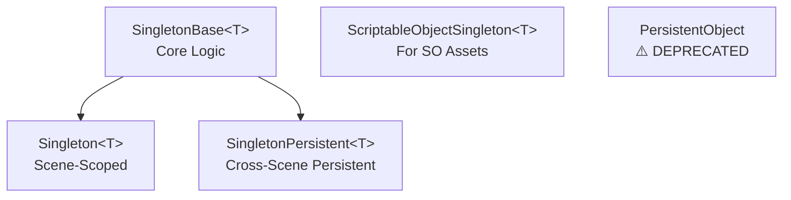

# 🏗️ Singleton Architecture Guide

## Overview

The codebase uses **THREE singleton patterns** optimized for different scenarios:



---

## 1️⃣ **SingletonBase&lt;T&gt;** (New Foundation)

**Purpose:** Shared logic for all singleton patterns — NO DUPLICATION

**Location:** `Assets/_Night_Hunt/Scripts/Core/Base/SingletonBase.cs`

**Features:**
- ✅ Generic (type-safe, no cross-class collisions)
- ✅ Duplicate detection & destruction
- ✅ Lazy loading via Instance getter
- ✅ Plugin architecture via `MakePersistent()` virtual method

**Usage:** Internal base class only — do NOT inherit directly

---

## 2️⃣ **Singleton&lt;T&gt;** (Scene-Scoped)

**Purpose:** Single-scene managers that DON'T survive scene loads

**Location:** `Assets/_Night_Hunt/Scripts/Core/Base/Singleton.cs`

**When to use:**
- ✅ Game-specific managers
- ✅ Event buses that are scene-local
- ✅ UI managers tied to one scene
- ❌ NOT for services needed across multiple scenes

**Example:**
```csharp
public class GameplayEventBus : Singleton<GameplayEventBus>
{
    protected override void OnSingletonAwake()
    {
        // Initialize game-specific event system
        Debug.Log($"[{gameObject.name}] Gameplay events ready for this scene only");
    }
}
// Access: GameplayEventBus.Instance.PublishEvent(...)
```

**Lifecycle:**
```
Scene Load → Awake (Instance set) → OnSingletonAwake()
    ↓
Scene Unload → OnDestroy (Instance cleared)
```

---

## 3️⃣ **SingletonPersistent&lt;T&gt;** (Cross-Scene Persistent)

**Purpose:** Services that MUST survive scene loads (DontDestroyOnLoad)

**Location:** `Assets/_Night_Hunt/Scripts/Core/Base/SingletonPersistent.cs`

**When to use:**
- ✅ Global game manager (GameManager)
- ✅ User session state (SessionState)
- ✅ Persistent UI (PersistentUICanvas)
- ✅ Backend services (BackendHttpClient)
- ✅ Audio manager, analytics, etc.

**Example:**
```csharp
public class GameManager : SingletonPersistent<GameManager>
{
    protected override void OnSingletonAwake()
    {
        // Initialize global services
        Debug.Log("[GameManager] Ready for entire app lifetime");
    }
}
// Access: GameManager.Instance.DoSomething()
```

**Lifecycle:**
```
First Scene → Awake (set persistent) → OnSingletonAwake()
    ↓
Scene Load/Unload → Instance persists (DontDestroyOnLoad)
    ↓
App Quit → OnDestroy (cleaned up)
```

---

## 4️⃣ **ScriptableObjectSingleton&lt;T&gt;** (Data Assets)

**Purpose:** Singleton access to ScriptableObject configuration assets

**Location:** `Assets/_Night_Hunt/Scripts/Core/Base/ScriptableObjectSingleton.cs`

**When to use:**
- ✅ Configuration data (BackendConfig, GameConfig)
- ✅ Lookup tables (ItemDatabase, CharacterDatabase)
- ✅ Constants stored as assets
- ❌ NOT for runtime logic or state

**Example:**
```csharp
[CreateAssetMenu(fileName = "BackendConfig", menuName = "NightHunt/Config/Backend Config")]
public class BackendConfig : ScriptableObjectSingleton<BackendConfig>
{
    public string apiHost = "localhost:8080";
    public bool useHttps = true;
}
// Access: BackendConfig.Instance.apiHost
```

**Setup:**
1. Create asset: Right-click → Create → NightHunt/Config/Backend Config
2. Place in: `Assets/Resources/Configs/BackendConfig.asset`
3. Optional: Right-click asset → "Cache Resources Path" (speeds up load)

---

## 5️⃣ **PersistentObject** (⚠️ DEPRECATED)

**Status:** **DO NOT USE** — Use `SingletonPersistent<T>` instead

**Why deprecated:**
- ❌ Non-generic (causes cross-class collisions)
- ❌ Shared static instance breaks multiple services
- ❌ Confusing API vs generic versions

**Migration:**
```csharp
// ❌ OLD
public class MyService : PersistentObject
{
    protected override void OnPersistentAwake() { ... }
}
public class Client { MyService service = PersistentObject.Instance as MyService; }

// ✅ NEW
public class MyService : SingletonPersistent<MyService>
{
    protected override void OnSingletonAwake() { ... }
}
public class Client { MyService service = MyService.Instance; }
```

---

## 📋 Decision Table

| Need | Use | Why |
|------|-----|-----|
| Scene-local manager | `Singleton<T>` | No cross-scene state needed |
| Global persistent service | `SingletonPersistent<T>` | Survives scene loads |
| Config/data asset | `ScriptableObjectSingleton<T>` | Loaded from Resources |
| UI only scene | `Singleton<T>` | UI-specific, not global |
| Backend client | `SingletonPersistent<T>` | Needs to exist across all scenes |
| Game events (scene-specific) | `Singleton<T>` | Event bus per scene |
| Session/user data | `SingletonPersistent<T>` | Must persist across scenes |

---

## 🔴 Common Mistakes

### ❌ Mistake 1: Using wrong base class
```csharp
// WRONG: Scene manager inherits from persistent
public class SpectateManager : SingletonPersistent<SpectateManager> { }
// → Will pollute other scenes

// RIGHT: Scene manager is scene-scoped
public class SpectateManager : Singleton<SpectateManager> { }
```

### ❌ Mistake 2: Putting logic in PersistentObject
```csharp
// WRONG: Still using deprecated class
public class MyService : PersistentObject { }

// RIGHT: Use generic base
public class MyService : SingletonPersistent<MyService> { }
```

### ❌ Mistake 3: Creating duplicates at runtime
```csharp
// WRONG: Multiple instances get created
for (int i = 0; i < 3; i++)
    new GameObject().AddComponent<MyManager>(); // → Only first survives, others destroyed

// RIGHT: Access or check existence
if (MyManager.HasInstance)
    MyManager.Instance.DoSomething();
else
    Debug.LogError("MyManager not initialized");
```

---

## 🧪 Testing

### Verify No Duplication
1. Open scene with multiple services
2. Check Console for: `Duplicate instance found`
   - ✅ Should appear 0 times
   - ❌ If it appears, wrong base class used

### Verify Persistence
1. Scene A loads with persistent service
2. Load Scene B
3. Check Instance.HasInstance
   - ✅ Should be true
   - ❌ If false, not marked as persistent

### Verify Cleanup
1. App quit
2. Check logs
   - ✅ OnDestroy called
   - ✅ Instance set to null

---

## 📊 Code Metrics

| Metric | Before | After |
|--------|--------|-------|
| Lines duplicated (Singleton vs SingletonPersistent) | 95% | 0% |
| Shared static fields | 1 (broken) | 0 |
| Generic instances | 2 | 1 base + 2 derived |
| Cross-class collisions | High | None |
| New deprecation warnings | 0 | 1 (PersistentObject) |

---

## 🚀 Migration Checklist

- [ ] Audit all classes inheriting from `PersistentObject`
- [ ] For each, decide: Scene-scoped or Persistent?
- [ ] Migrate to `Singleton<T>` or `SingletonPersistent<T>`
- [ ] Update `OnPersistentAwake()` → `OnSingletonAwake()`
- [ ] Test: Run game, check for duplicate warnings
- [ ] Remove old `PersistentObject` subclasses from scene
- [ ] Delete `PersistentObject.cs` (after all migrations)

---

## 📝 Architecture Summary

**Single Source of Truth:**
```
SingletonBase<T> (shared core logic)
    ├─ Singleton<T> (override: nothing = scene-scoped)
    └─ SingletonPersistent<T> (override: MakePersistent = DontDestroyOnLoad)
```

**Formula:**
- **Singleton<T>** = SingletonBase<T> + no persistence
- **SingletonPersistent<T>** = SingletonBase<T> + DontDestroyOnLoad
- **Result:** Zero code duplication, crystal clear intent, type-safe

---

## 🎯 Benefits

✅ **DRY (Don't Repeat Yourself)** — Single source of truth for singleton logic  
✅ **Type Safety** — Generic instances prevent cross-class collisions  
✅ **Clear Intent** — Name alone tells you persistence scope  
✅ **Easy Maintenance** — Fix bug in base → all singletons benefit  
✅ **Scalability** — Add new patterns by extending SingletonBase<T>  
✅ **Backward Compatible** — Old PersistentObject still works (but deprecated)  

---

**Last Updated:** March 19, 2026  
**Author:** Architecture Team
