# 🎮 NightHunt Gameplay Flow Diagrams

Tài liệu mô tả toàn bộ luồng và chức năng của gameplay system.

## 📋 Mục lục

1. [Kiến trúc tổng quan](#1-kiến-trúc-tổng-quan)
2. [Luồng chính](#2-luồng-chính)
3. [Hệ thống chính](#3-hệ-thống-chính)
4. [UI System Flow](#4-ui-system-flow)
5. [Spectate Mode Flow](#5-spectate-mode-flow)
6. [Interaction System](#6-interaction-system)
7. [QuickSlot System](#7-quickslot-system)
8. [Data Flow](#8-data-flow)

---

## 1. Kiến trúc tổng quan

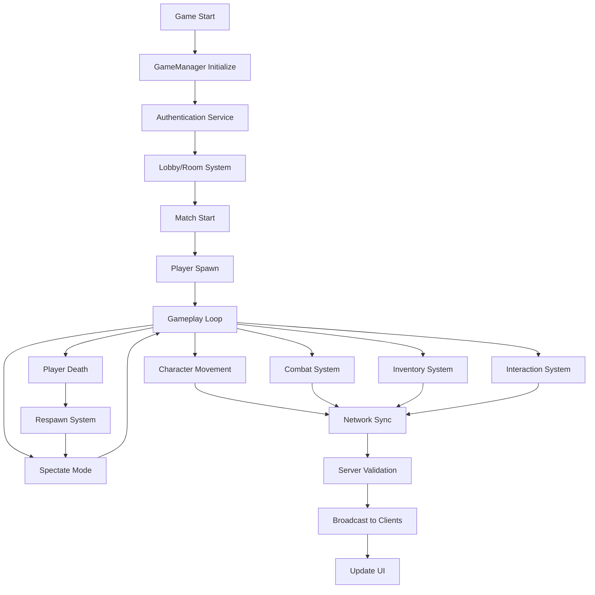

---

## 2. Luồng chính

### 2.1 Game Manager & Services

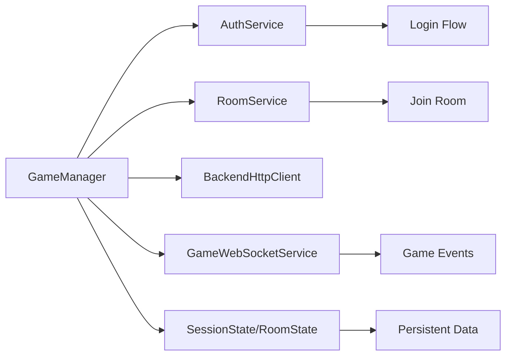

### 2.2 Network System

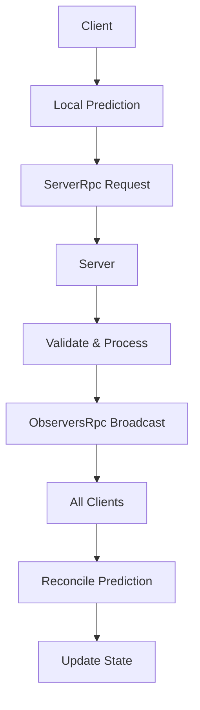

### 2.3 Character System

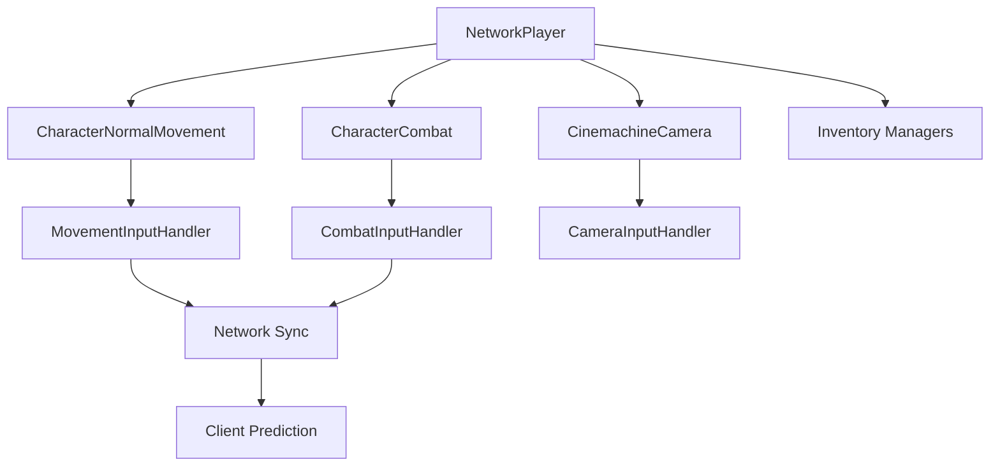

---

## 3. Hệ thống chính

### 3.1 Inventory System Architecture

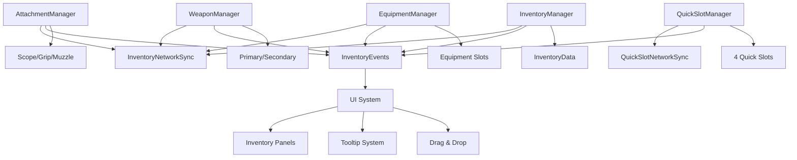

### 3.2 Inventory Slot Locations

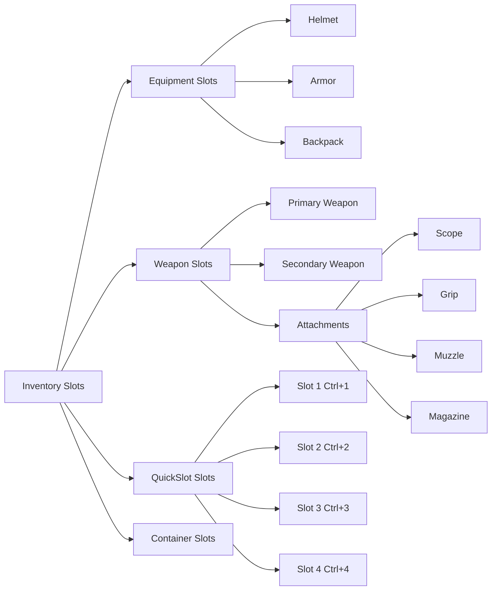

---

## 4. UI System Flow

### 4.1 UI Root Controller Flow

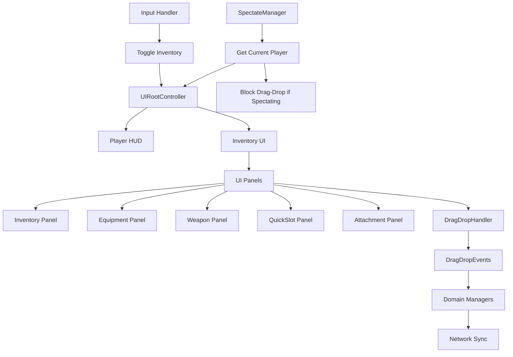

### 4.2 Drag & Drop Flow

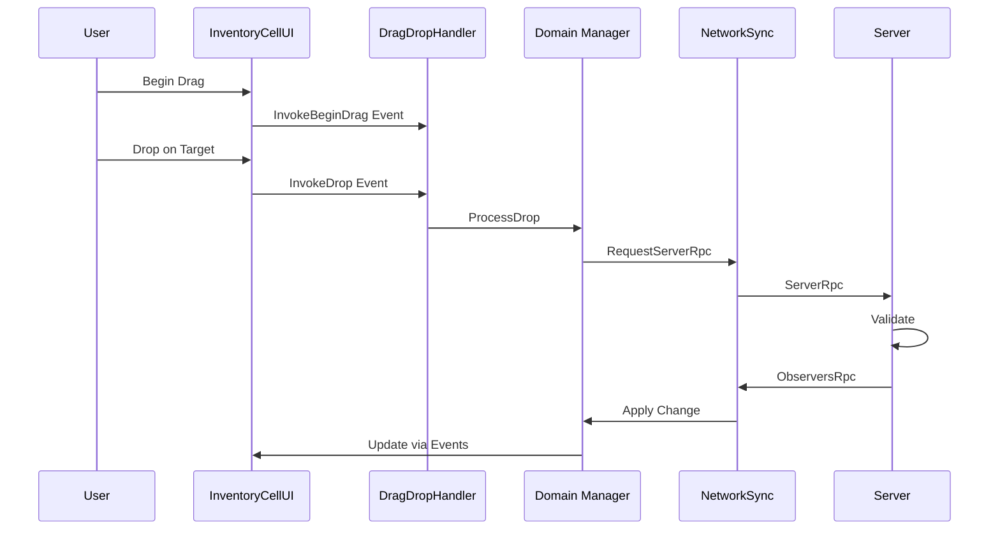

---

## 5. Spectate Mode Flow

### 5.1 Spectate Mode Architecture

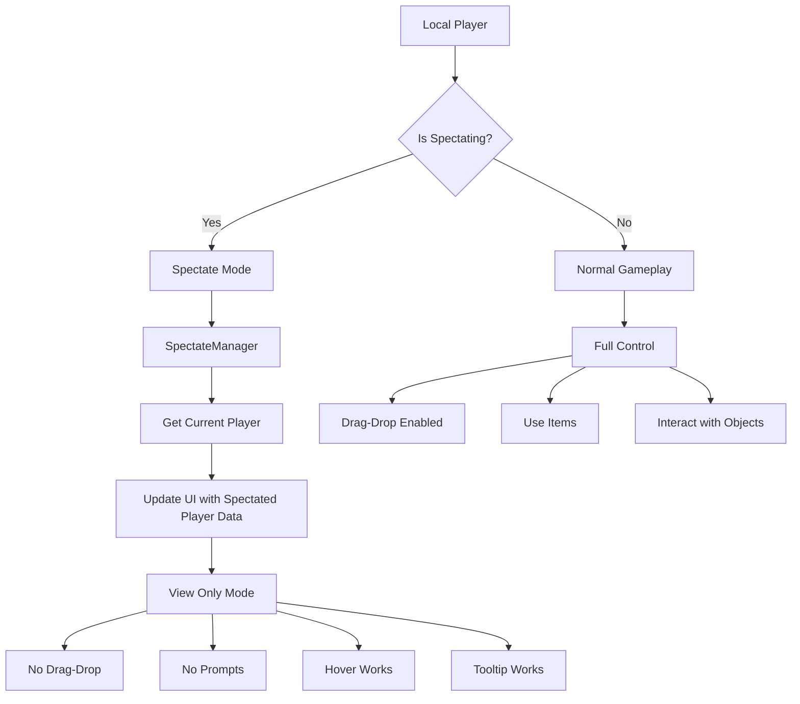

### 5.2 Spectate Mode State Flow

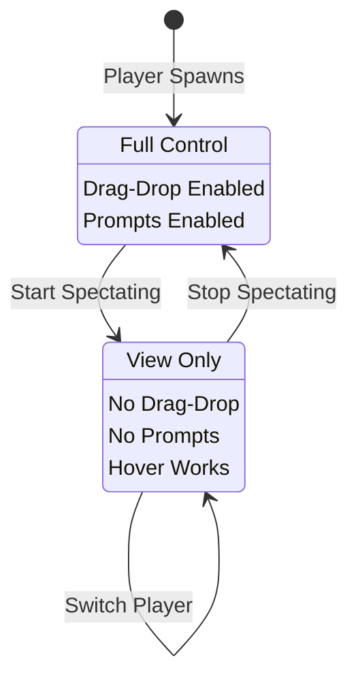

---

## 6. Interaction System

### 6.1 Interaction Detection Flow

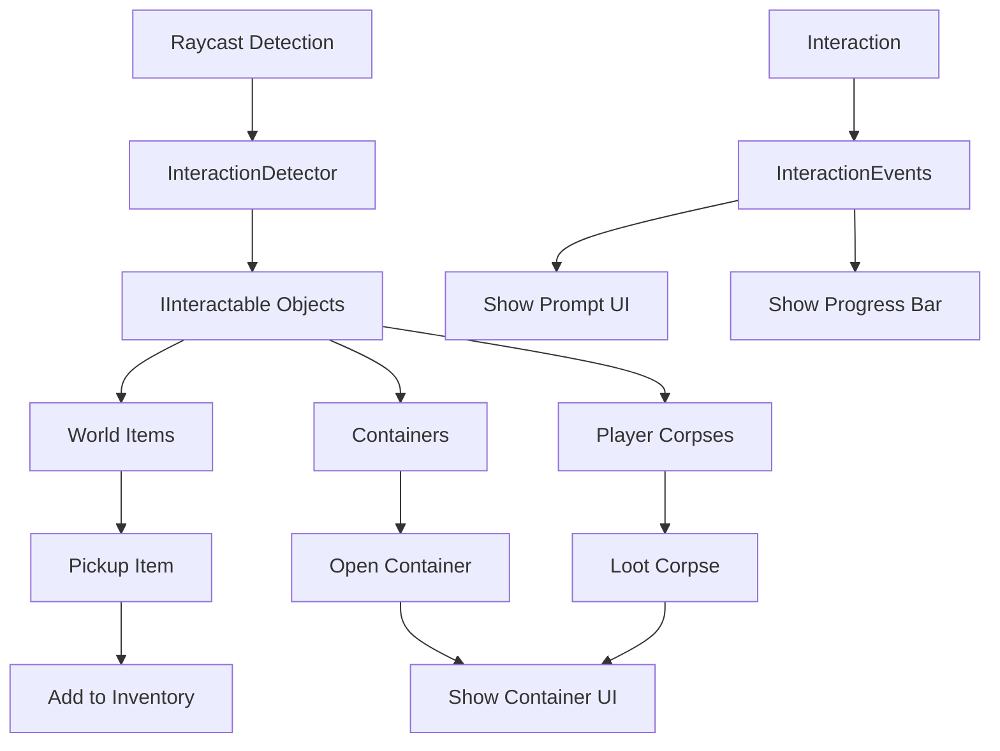

### 6.2 Container Interaction Flow

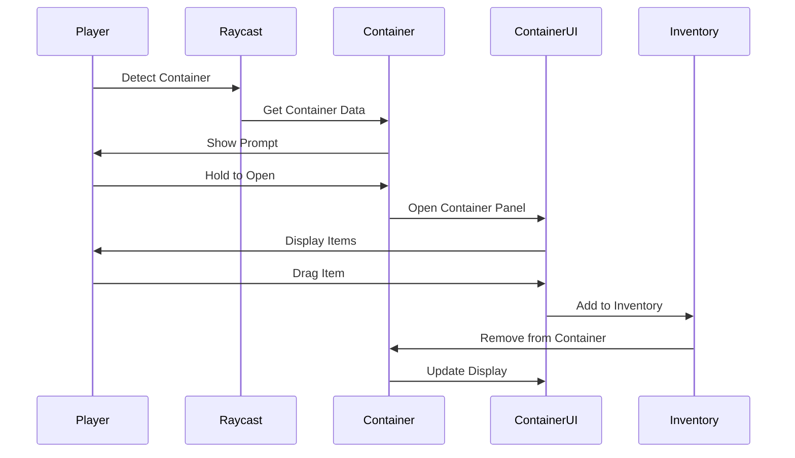

---

## 7. QuickSlot System

### 7.1 QuickSlot Input Flow

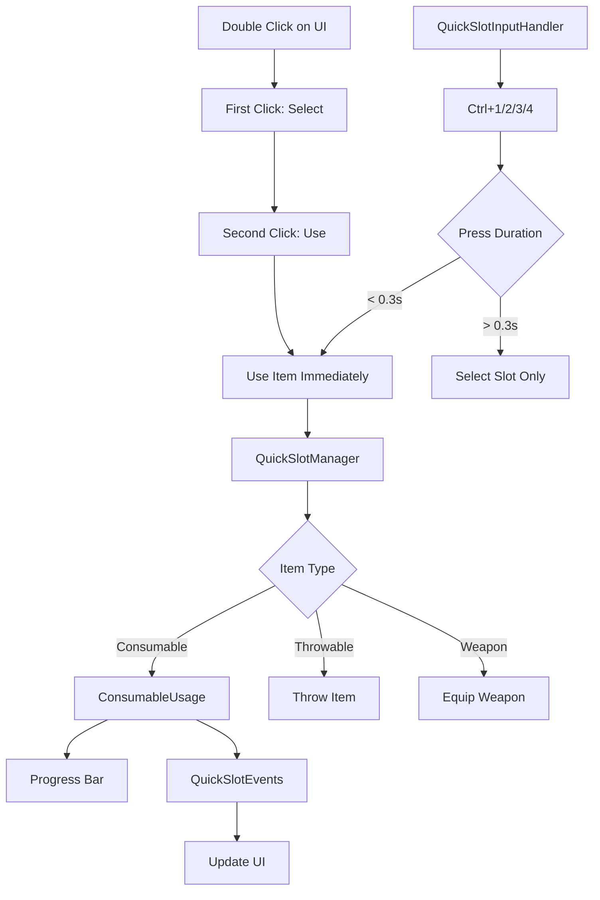

### 7.2 QuickSlot Usage Flow

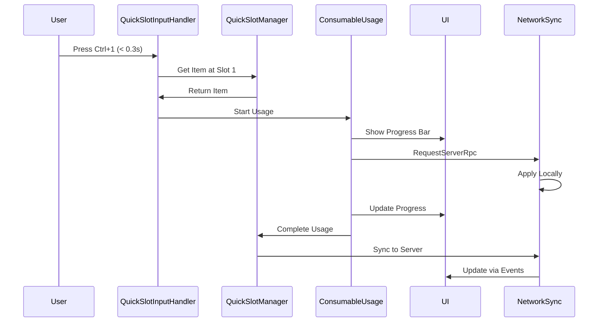

---

## 8. Data Flow

### 8.1 Network Synchronization Flow

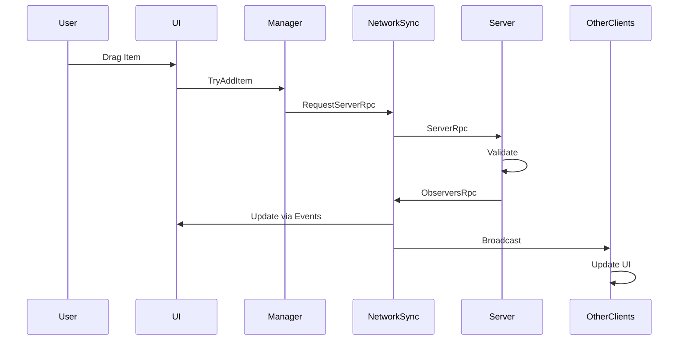

### 8.2 Event-Driven Architecture

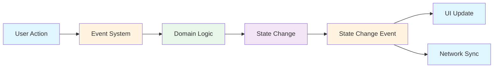

---

## 9. State Management

### 9.1 UI Slot States

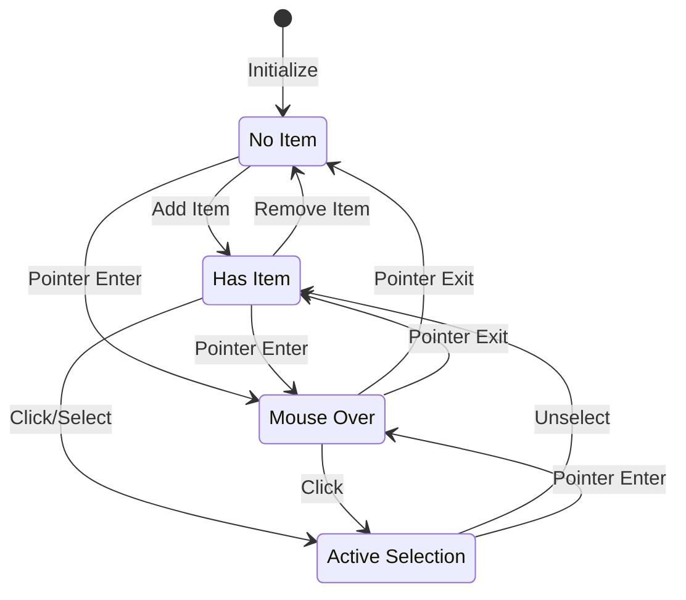

---

## 10. Component Relationships

### 10.1 Manager Dependencies

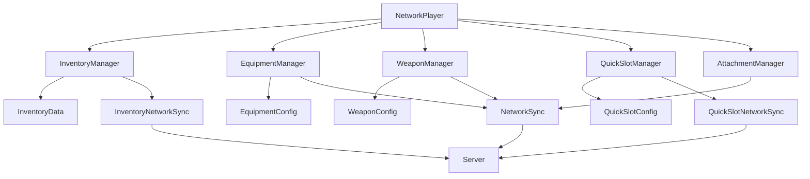

---

## 📝 Ghi chú

- Tất cả các sơ đồ sử dụng Mermaid syntax
- Có thể render trên GitHub, GitLab, hoặc các markdown viewer hỗ trợ Mermaid
- Sơ đồ được cập nhật theo kiến trúc hiện tại của game

---

**Version**: 1.0.0  
**Last Updated**: 2024  
**Unity Version**: 6.0+  
**FishNet Version**: Pro v4+
